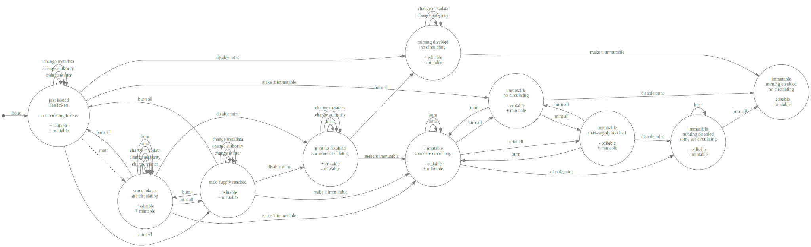
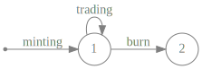

<!--
order: 1
-->

# Concepts

## Conventions

By looking at numbers, we separate the decimals by point and the thousands by comma. For instance, the number _one thousand two hundred thirty-four and fifty-six hundredths_, is written as:


## FanToken

FanTokens, conceptually based on the [ERC-20 Standard](https://ethereum.org/it/developers/docs/standards/tokens/erc-20), are **fungible tokens** issued for fan communities. They borns to create new connections between fans and any content creator, like star performers, actors, designers, musicians, photographers, writers, models, influencers, etc.
They enable the growth of a private and (most importantly) custom economy creating new channels for fans' engagement.
_FanTokens_ have enormous potential. By using them, you can build myriad applications allowing fans a deeper interaction in the artistic life of their top performers.

To provide you with some examples, you can think that it is possible to use them for creating loyalty programs to provide privileged access to exclusive content. To allow your fan to crowdfund a tour or studio album and share part of the revenue with your fans. To enable your fans with the opportunity to vote on the cities for an upcoming tour. Or even to accept _FanTokens_ as payment for NFTs.

In the design of the _FanToken_ functionalities, big part of the reasonings were based on the [OpenZeppelin standard](https://docs.openzeppelin.com/contracts/4.x/api/token/erc20). For example, the concept of *burning* the tokens lowering the `totalSupply` directly derives from the standard [documentation](https://docs.openzeppelin.com/contracts/4.x/api/token/erc20#ERC20-_burn-address-uint256-).

A **FanToken** is characterized by:
| Attribute | Type | Description |
| --------------------- | ---------------------------- | ---------------------------------------------- |
| denom | `string` | It is an hash calculated on the first `Minter`, the `Symbol`, the `Name` and the `Block Height` of the issuing transaction of the _FanToken_. It is the hash identifying the _FanToken_ and is used to [prevent the creation of identical tokens](#Uniqueness-of-the-denom). Moreover, to fastly identify a _FanToken_ from its `denom`, it starts with the prefix `ft`.|
| max_supply | `sdk.Int` | It is chosen once by the user. It is the maximum supply value of mintable tokens from its definition. It is expressed in micro unit (). For this reason, to indicate a maximum supply of  tokens, this value must be equal to .|
| Minter | `sdk.AccAddress` | It is the address of the minter for the _FanToken_. It can be changed to trasfer the minting ability of the token during the time. |
| metadata | `Metadata` | It is generated once and it is made up of `Name`, `Symbol`, `URI` and `Authority` (i.e., is the address of the wallet which is able to perform edits on the `URI`). More specifically, the URI contains a link to a resource with a set of information linked to the _FanToken_.|

**Metadata** are characterized by:
| Attribute | Type | Description |
| --------------------- | ---------------------------- | ---------------------------------------------- |
| name | `string` | It is chosen once by the user. It should correspond to the long name the user want to associate to the symbol (e.g., Dollar, Euro, BitSong). It can also be empty and its max length is of 128 characters. |
| symbol | `string` | It is chosen once by the user and can be any string matching the pattern `^[a-z0-9]{1,64}$`, i.e., any lowercase string containing letters and digits with a length between 1 and 64 characters. It should follow the ISO standard for the [alphabetic code](https://www.iso.org/iso-4217-currency-codes.html) (e.g., USD, EUR, BTSG, etc.).|
| uri | `string` | It is a link to a resource which contains a set of information linked to the _FanToken_. It can also be empty and its max length is of 512 characters. |
| authority | `sdk.AccAddress` | It is the address of the authority for the _FanToken_ `metadata` managment. It can be changed to trasfer the ability of changing the metadata the token during the time. |


## Lifecycle of a FanToken

It is possible to entirely represent the lifecycle of a FanToken through Finite State Machine (FSM) diagrams. We will present two representations:

- the first refers to the FanToken **object**. We can compare such a definition with that of currency (e.g., Euro, Dollar, BitSong);
- the second, instead, is referred to the lifecycle of the FanToken **instance**. Such definition is comparable with that of coin/money (e.g., the specific 1 Euro coin you could have in your pocket at a particular moment in time).

We can describe the lifecycle of a FanToken **object** through two states.



Referring to the figure above, as detailed in the documentation, to "create" the FanToken, we need to **issue it**. This operation leads to the birth of the object and thus to its first state, state _1_. Here, the token is related to a `minter`, who is able to mint the token to different wallets, and an `authority`, that is responsible for managing the `metadata`. It is important to recall that some operations are reversible, while some others are not. For example, reaching the max-supply through minting operations, can be reverted by burning tokens. While, for example, the selection of an empty address for the minter (which strictly means **disable minting** operations) is a **irreversible** operation.

Referring to the lifecycle of a FanToken **instance**, it is possible to identify two states.



Concerning to the figure above, when the FanToken object is issued, we can **mint** it. Minting leads to the birth of a new instance, moving the FanToken instance to state _1_. In this state, the token can be:

- **traded**, which produces the changing of the owner of the instance, without modifying the landing state. To make it clearer, it can be considered as the simple exchange of money between two users. This does not modify the landing state;
- **burned**, which produces a state change to the state _2_, where the authority cannot operate on the FanToken instance anymore.

## Uniqueness of the denom

The _denom_ is calculated on first `Minter`, `Symbol`, `Name` and `Block Height` of the issuing transaction of the FanToken. 

```go
func GetFantokenDenom(height int64, minter sdk.AccAddress, symbol, name string) string {
	bz := []byte(fmt.Sprintf("%d%s%s%s", height, minter.String(), symbol, name))
	return "ft" + tmcrypto.AddressHash(bz).String()
}
```

The _denom_ of every FanToken starts with the prefix `ft`. Follows a **hash** of `Block Height`, first `Minter`, `Symbol` and `Name` of the _FanToken_. This _denom_ is used as base denom for the FanToken, and, for this reason, it should be **unique**. In this sense, since the hash depends both on the first `Minter` and the `Block Height`, multiple FanTokens with the same name and symbol can co-exist even created by the same address but they must be created from transactions in different blocks.
